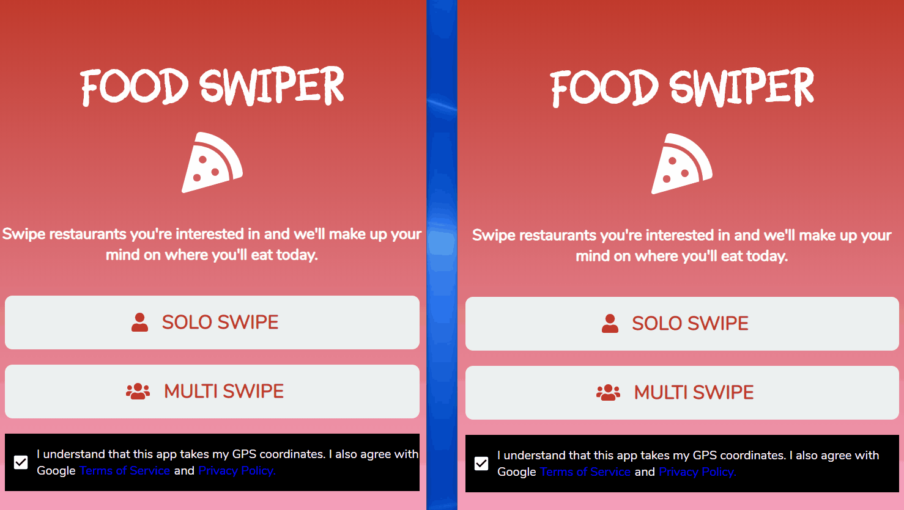

# Food Swiper

Decides for you on where to eat in no time

## Getting Started

Website to the beta version can be seen here: https://boiling-headland-74814.herokuapp.com


### Prerequisites

Clone the repository onto your local area and type in bash:

```
npm install
```

### Installing

Within the root project folder, to start the node server:

```
node server.js
```

Within the root project folder, to start the react server:

```
npm start
```

## Demonstration




## Built With
* [React](https://reactjs.org/) - Front-end framework used
* [MongoDB](https://www.mongodb.com/) - database for the App
* [Express](https://expressjs.com/) - Back-end server
* [Socket.io](https://socket.io/) - For client to client connectivity
* [react-tinder-card](https://www.npmjs.com/package/react-tinder-card) - To give it a Tinder like feel
